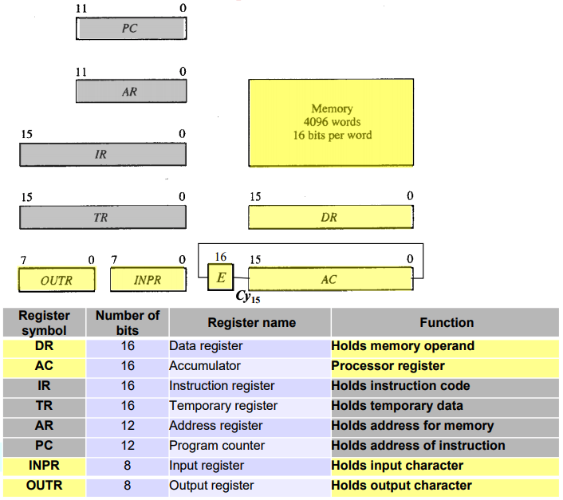
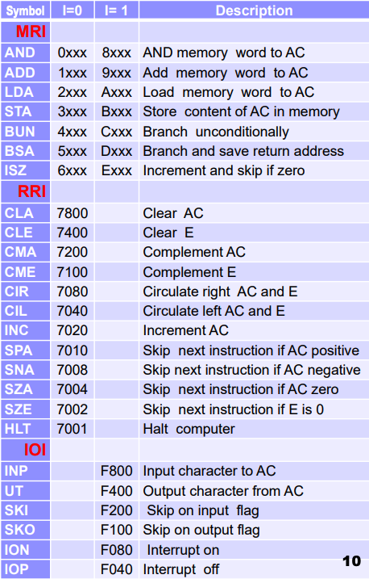

# basic

Pure go implementation of the Mano machine.

Created by me for fun / in order to understand the internals for my CEG2136 exam (probably an overkill
study strategy but definitely fun).

It is capable of executing the simple instructions on a 16-bit architecture consisting of an ALU + CU and a data bus.

## Usage

Grab it via `go get github.com/karimsa/basic`.

### Compiling & running

`hello.s`:

```asm
ORG 0
  LDA H
  UT
  LDA I
  UT
  LDA LF
  UT
  HLT

H: HEX 68
I: HEX 65
LF: HEX 0A
```

```shell
$ go run ./cmd/asm/asm.go hello.s hello.out
$ go run ./cmd/boot/boot.go hello.out
hi
Halting
```

## Architecture

### Registers

The CPU has 9 registers and a 4096x16 memory unit. The breakdown is from the lecture slides:



### Instruction set

Supported instructions (in machine code):



## License

Licensed under MIT license.

Copyright &copy; 2018-present Karim Alibhai.
